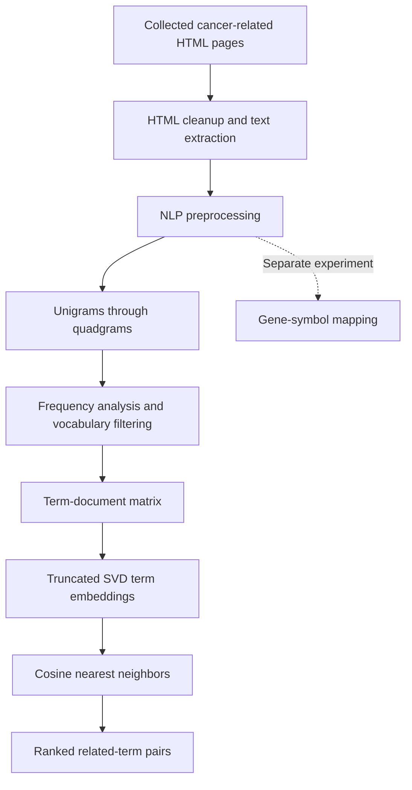

# Cancer Overview — NLP-Based Term Relationship Analysis

**Turning cancer-related web content into a searchable map of words and phrases using NLP, n-grams, SVD, and nearest neighbors.**

Cancer information is spread across many web pages. This project explores how that text can be transformed into structured data to identify recurring terminology and discover terms used in similar document contexts.

The workflow starts with collected HTML pages, cleans and preprocesses their text, extracts one- to four-word phrases, and represents their occurrence across documents as a numerical matrix. Singular Value Decomposition (SVD) then creates compact term representations, which are compared using cosine nearest neighbors.

This is an exploratory text-mining project. Its output is a set of corpus-based term similarities; it does not predict cancer or establish clinical relationships.

## Project at a glance

| Item | Description |
| --- | --- |
| Domain | Cancer-related website content |
| Approach | Unsupervised NLP and term similarity |
| Features | Unigrams, bigrams, trigrams, and quadgrams |
| Representation | Term-document count matrix |
| Dimensionality reduction | Truncated SVD |
| Relationship discovery | Cosine nearest-neighbor search |
| Saved matrix | 37,968 term rows × 2,285 document columns |
| Saved neighbor output | 379,680 term–neighbor records |
| Additional experiment | Gene-symbol matching across documents |

These sizes describe the existing saved artifacts, not a newly reproduced run or a measure of model accuracy.

## How the project works



### 1. Collect and extract website text

The original workflow collected cancer-related web pages and removed unwanted page elements such as headers and footers before working with their text.

The included extraction notebook checks HTML inputs, detects English content, extracts body text with Beautiful Soup, and applies an initial NLTK preprocessing pass. Rejected inputs are moved into quarantine folders.

**Repository coverage:** the crawler and the earlier header/footer removal code are not included. The extraction notebook itself does not implement that boilerplate removal.

### 2. Clean the text with NLP

A second cleaning stage uses spaCy to prepare the text for vocabulary extraction. It:

- Converts text to lowercase and removes URLs and email addresses.
- Filters stopwords, punctuation, and numeric tokens.
- Keeps nouns, proper nouns, and adjectives.
- Removes tokens identified as people, organizations, or geopolitical entities.
- Lemmatizes retained tokens and keeps lemmas longer than two characters.

The cleaned tokens are saved as text files, one per input document. An optional custom stopword list supports iterative refinement.

### 3. Build n-grams

An **n-gram** is a sequence of *n* consecutive tokens. Using several lengths lets the project represent both individual concepts and longer phrases.

| Type | Tokens | Illustrative example |
| --- | ---: | --- |
| Unigram | 1 | `cancer` |
| Bigram | 2 | `breast cancer` |
| Trigram | 3 | `breast cancer treatment` |
| Quadgram | 4 | `advanced breast cancer treatment` |

These examples explain the feature types; they are not claimed model results. In this implementation, sequences come from the cleaned token stream, so removed words can change which tokens become adjacent.

For each n-gram, the project records:

| Column | Meaning |
| --- | --- |
| `1-gram` through `4-gram` | The word or phrase |
| `documents` | Number of documents containing the n-gram |
| `total freq` | Total occurrences across the corpus |
| `avg` | Total occurrences divided by the number of containing documents |

### 4. Analyze and refine the vocabulary

Frequency statistics support exploratory filtering. The notebooks include percentile-analysis code, extraction of candidate stopwords from widely occurring trigrams, and removal of multiword grams containing repeated tokens. Unigrams and bigrams are also filtered to retain those appearing in more than two documents.

A separate experiment subtracts frequencies of longer phrases from their shorter constituent grams to try to account for nested phrases. This adjustment has known correctness issues and is retained as historical research code. High frequency alone is not evidence that a term is unimportant.

### 5. Construct the term-document matrix

The selected unigram, bigram, trigram, and quadgram vocabularies are combined into a matrix:

- **Rows:** vocabulary terms.
- **Columns:** documents.
- **Values:** occurrence counts computed for each term in each document.

Each row therefore describes where a term appears across the corpus. The saved matrix contains **37,968 term rows and 2,285 document columns**, plus a `name` column containing the terms.

The current implementation uses substring counting, which can match inside larger words. Exact token-sequence counting is a planned correction. The adjusted frequency totals from the previous stage are not used as matrix weights; documents are counted again using those tables as vocabulary lists.

### 6. Reduce dimensions with SVD

The SVD notebook explores several component counts using cumulative explained variance, then uses **100 components** to build compact term vectors.

Truncated SVD approximates the original matrix as:

```text
X ≈ Uₖ Σₖ Vₖᵀ

X:       terms × documents
Uₖ Σₖ:   terms × k latent dimensions
```

These latent dimensions summarize patterns in document usage. They are learned numerical features, not manually labeled cancer categories.

### 7. Find related terms with nearest neighbors

The term vectors are normalized and compared using cosine distance. The notebook requests neighbors for each term and exports ten ranked candidates after attempting to remove the query term itself.

Here, “KNN” refers to **nearest-neighbor retrieval** using scikit-learn's `NearestNeighbors`. There are no class labels or supervised classifier predictions.

The output file, [`best_neibhours.csv`](results/neighbors/best_neibhours.csv), retains its original filename and contains:

| Column | Meaning |
| --- | --- |
| `term` | Query word or phrase |
| `neighbor` | Retrieved neighboring term |
| `rank` | Position in the neighbor list |
| `cosine_sim` | `1 − cosine distance` between the term vectors |

Higher cosine similarity indicates more similar directions in the learned vector space. It is not a probability or evidence of a biological connection. Shared boilerplate, counting errors, and similar document distributions can also produce close neighbors.

## Explore the saved results

You can inspect the neighbor table without rerunning preprocessing or SVD. Run this example from the repository root after installing the dependencies:

```python
import pandas as pd
from project_paths import NEIGHBORS_FILE

neighbors = pd.read_csv(NEIGHBORS_FILE)
query = "cancer"

matches = neighbors.loc[
    neighbors["term"].eq(query),
    ["neighbor", "rank", "cosine_sim"],
].sort_values("rank")

print(matches.to_string(index=False))
```

Change `query` to another term present in the saved vocabulary.

## Repository structure

```text
Cancer-overview-ml/
├── notebooks/
│   ├── 01_text_extraction.ipynb
│   ├── 02_data_cleaning.ipynb
│   ├── 03_ngrams.ipynb
│   ├── 04_ngram_cleaning.ipynb
│   ├── 05_frequency_adjustment.ipynb
│   ├── 06_term_document_matrix.ipynb
│   ├── 07_svd_neighbors.ipynb
│   └── phase_2/
│       └── gene_mapping.ipynb
├── data/
│   ├── raw/
│   │   ├── html/                 # Input HTML corpus (not included)
│   │   └── reference/            # Optional gene_info.csv (not included)
│   ├── interim/
│   │   ├── text/                 # Extracted/preprocessed text
│   │   ├── cleaned_text/         # spaCy-cleaned documents
│   │   └── quarantine/           # Rejected input samples
│   ├── external/                 # Optional custom stopwords
│   └── processed/
│       ├── ngrams/               # Saved vocabulary and frequency tables
│       └── matrices/             # Term-document matrix (Git LFS)
├── results/neighbors/            # Saved term-neighbor rankings
├── docs/
│   ├── analysis.md               # Detailed implementation review
│   └── file_migration.json       # Original locations and artifact hashes
├── project_paths.py              # Shared repository-relative paths
├── requirements.txt
└── README.md
```

## Setup and usage

### Download the project

Install Python and Git with Git LFS available, then run:

```bash
git lfs install
git clone https://github.com/Prashil001/Cancer-overview-ml.git
cd Cancer-overview-ml
git lfs pull
```

The term-document matrix is approximately **174 MB** and is stored with Git LFS. If you already have a clone, run `git lfs install` and `git lfs pull` inside it to retrieve the matrix contents.

### Install dependencies

Create and activate a virtual environment. On Windows PowerShell:

```powershell
python -m venv .venv
.\.venv\Scripts\Activate.ps1
```

On macOS or Linux:

```bash
python3 -m venv .venv
source .venv/bin/activate
```

Then install the libraries and language resources:

```bash
python -m pip install -r requirements.txt
python -m spacy download en_core_web_sm
python -m nltk.downloader punkt punkt_tab stopwords wordnet
python -m jupyterlab
```

Launch Jupyter from inside the repository. The notebooks locate shared data paths through [`project_paths.py`](project_paths.py).

The main libraries are Beautiful Soup for HTML parsing, NLTK and spaCy for NLP, pandas and NumPy for data processing, scikit-learn for SVD and neighbor search, and Matplotlib for variance plots. Dependencies are not yet version-locked to a validated environment.

### Work through the notebooks

The numbered notebooks describe the pipeline order, but a fresh end-to-end run needs additional inputs and corrections:

1. Supply the HTML corpus in `data/raw/html/`. Use a copy because the extraction notebook moves rejected inputs.
2. Run stages **01–03** to extract text, clean it, and produce n-gram statistics.
3. Use stage **04** to inspect vocabulary filtering and candidate stopwords. Stage 02 permits an initial pass without `data/external/trigramStopWords.csv`; review any generated list before repeating stages 02–03.
4. Review the frequency-adjustment issues before using stage **05**. Stage 04 also needs its currently commented trigram-generation step restored to regenerate all vocabulary outputs.
5. Stages **06–07** build the matrix and retrieve neighbors. Correct the counting and self-neighbor handling described below before treating a regenerated run as validated.

Later stages overwrite their output CSVs. Preserve the supplied baseline artifacts before experimenting. Existing notebook outputs are historical and have not been regenerated during repository organization.

## Phase 2: gene-symbol mapping

The separate [`gene_mapping.ipynb`](notebooks/phase_2/gene_mapping.ipynb) experiment reads gene symbols from a reference table and matches lowercased symbols against words in cleaned documents. It builds a mapping from matched symbols to document IDs.

This experiment requires `data/raw/reference/gene_info.csv`, which is not supplied. Symbol ambiguity, loss of short symbols during cleaning, and document-ID consistency need further attention. It does not currently establish gene–cancer associations.

## Current limitations and next steps

The repository preserves the original exploratory results and documents where the implementation needs improvement:

| Area | Current limitation | Next step |
| --- | --- | --- |
| Reproducibility | Source corpus, crawler, earlier HTML cleaner, and reference inputs are missing | Add collection instructions, source metadata, and a validated environment |
| Counting | Matrix construction counts substrings | Count exact token sequences, including overlapping matches |
| Frequency adjustment | Saved tables contain 84 negative unigram and 2 negative bigram totals | Define and validate a document-level overlap policy |
| Text preprocessing | Multiple cleaning passes can remove meaningful context and create artificial phrases | Preserve extracted text and generate phrases within sentence boundaries |
| Stopwords | Custom flags and frequency-derived exclusions need review | Validate stopword application and retain relevant domain terms |
| Document identity | Numeric IDs lack a persisted filename/URL mapping | Save a stable document manifest shared across stages |
| Neighbor retrieval | Removing the first result may fail to remove self-matches when vectors tie | Exclude the query by row index and handle zero vectors |
| Evaluation | No reviewed term-pair benchmark is included | Compare weighting methods and evaluate retrieved relationships |

See [`docs/analysis.md`](docs/analysis.md) for the detailed findings. The project provides a foundation for exploring cancer terminology, with the next development work focused on reliable counting, reproducibility, and evaluation.
